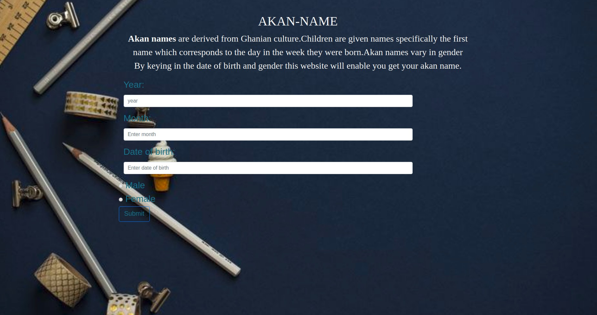

## Table of Contents
- Project Title
- Description
- BDD (Behaviour Driven Development)
- Project view
- Technologies used
- Acknowledgement
- Licence
- Contacts
- Author
# Akan-Name
## DESCRIPTION
- Akan-name project, is a project that lets users know their Akan names and day of the week that they were actually born. Akan names are
cultural names given to people in western africa specifically in Ghana. The name are given in referencce to their gender and also the day 
of the week they are born.
## Deployment
- You can view this site directly [here] https://hammertonmutuku.github.io/Akan-name/

## BDD
The user will be required to fill in the form corretly that is the year of birth, date of birth , month of birth and the actuall date.
Once the user clicks the submit button, the system will output the relative information.
- NB : All input should be in Numbers
## Project view

## Technologies Used
- html
- css
- javascript
- bootsrap

## Acknowledgement
This project could not be possible were it not for God, my technical mentors and colleges.

## Licence
The MIT License (MIT)
Permission is hereby granted, free of charge, to any person obtaining a copy of this software and associated documentation files (the "Software"), to deal in the Software without restriction, including without limitation the rights to use, copy, modify, merge, publish, distribute, sublicense, and/or sell copies of the Software, and to permit persons to whom the Software is furnished to do so, subject to the following conditions:
The above copyright notice and this permission notice shall be included in all copies or substantial portions of the Software.
THE SOFTWARE IS PROVIDED "AS IS", WITHOUT WARRANTY OF ANY KIND, EXPRESS OR IMPLIED, INCLUDING BUT NOT LIMITED TO THE WARRANTIES OF MERCHANTABILITY, FITNESS FOR A PARTICULAR PURPOSE AND NONINFRINGEMENT. IN NO EVENT SHALL THE AUTHORS OR COPYRIGHT HOLDERS BE LIABLE FOR ANY CLAIM, DAMAGES OR OTHER LIABILITY, WHETHER IN AN ACTION OF CONTRACT, TORT OR OTHERWISE, ARISING FROM, OUT OF OR IN CONNECTION WITH THE SOFTWARE OR THE USE OR OTHER DEALINGS IN THE SOFTWARE.
@Hammertonmutuku

## Contacts
 Incase of any feedback you can reach me through my personal contacts:
 Hammertonmutuku
 lthamma3@gmail.com

## Author
**Hammertonmutuku**